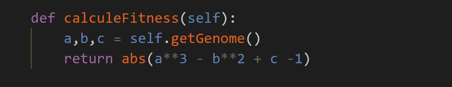
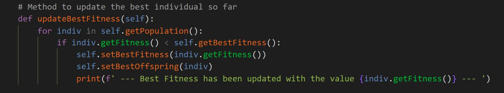
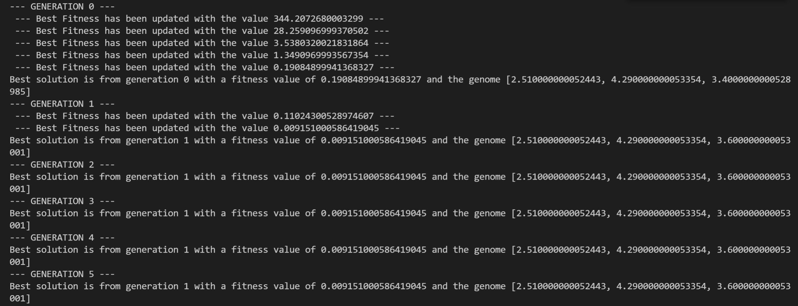
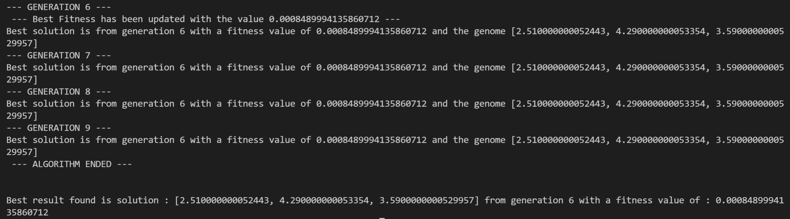

# AlgoGeneticTemplate

This repository contain a ready to use template to customize your own genetic algorithm easily.
You just have to find a representation of your problem as an array and to implement the fitness function.

You can also edit the mutation part as a random choice is not always the best way

## Example

I also implemented a small example with the template to show how to use it

We will try to solve this easy problem : find [a,b,c] E [-100,100]^3 such that a^3 - b^2 + c -1 = 0

A chromosome is a list of 3 genes [a,b,c]

The fitness value is the absolute value of a^3 - b^2 + c -1

We seek to minimize the fitness value

We use a discrete representation of the possible alleles with a 0.01 step

### Fitness function

We have to implement the fitness function, here it is simply the absolute value of the function of a,b,c

### Minimizing the fitness

We also have to make sure that we keep the lowest fitness as the best fitness

Here the inequality sign is < as we want to get a fitness as low as possible to solve the equation

### Results

We ran the algorithm with a mating pool of 100 as well as 100 offsprings made by each couple, which is a total population of 5000 individuals

After 10 generations, we can see that we found a solution (a,b,c) such that abs(a^3 - b^2 + c -1) < 10^-3

You can run this code which is AlgoGeneticTemplate_example.py

## Requirements

You just need the numpy package to manipulate arrays
